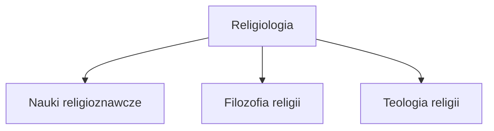

#### Zaliczenie
Nie ma egzaminu na półrocze, a na koniec roku jest test. Zaliczenie - zagadnienie do opracowania i przedstawienia.

### Podstawowe definicje
>[!tip] Religia -życiowa więź człowieka z Bogiem

>[!tip] Religiologia - ogół nauk zajmujących się religią

> [!warning] Religiologia (nauki religijne) =/= Religioznastwo
### Metodologia

